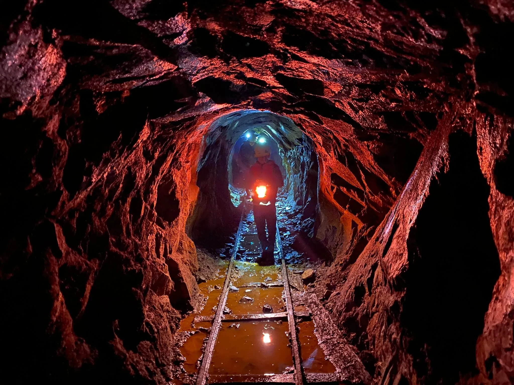

#Sala becoming 400 years
This website about the Sala city locality in Sweden.
And nexst year sala becoming 400 years

## Features

### Existing Features

- __Navigation Bar__
The top of page responsive navigation bar feature link to Home,Gallery,Sala400, and ContactUs page.
Sala 400 logo serves as a link to the Start page.
This is consistent navigation bar design user freindly navigation.

.png)

### Home

  The Home Page is the landing page,offering big photo of place in Sala

.png)

### Gallery
The Gallery page shows images of places in sala you can visite.

.png)

### Sala 400
The Sala 400 page have some information about Sala

### Contact us
The Contact us page enables users to request more information about outdoor activities, listed on the activities page. It includes fields for name, email, and radio buttons to select.
.png)

### Features Left to Implement

- Include Map and Directions.
- Expand Location information.
- Integrate Customer Reviews.
- Incorporate Accommodation info.
- Live View & weather conditions.

## Testing

### Validator Testing

#### HTML

No errors were returned when passing through the [W3C Markup validator](https://validator.w3.org/).

#### CSS

No errors were found when passing through the [W3C CSS Validator](https://jigsaw.w3.org/css-validator/) validator

#### Google Chrome Lighthouse Reports
-These reports present the results of Lighthouse testing, which evaluates performance, accessibility, best practices, and SEO (Search Engine Optimization).

.png)

